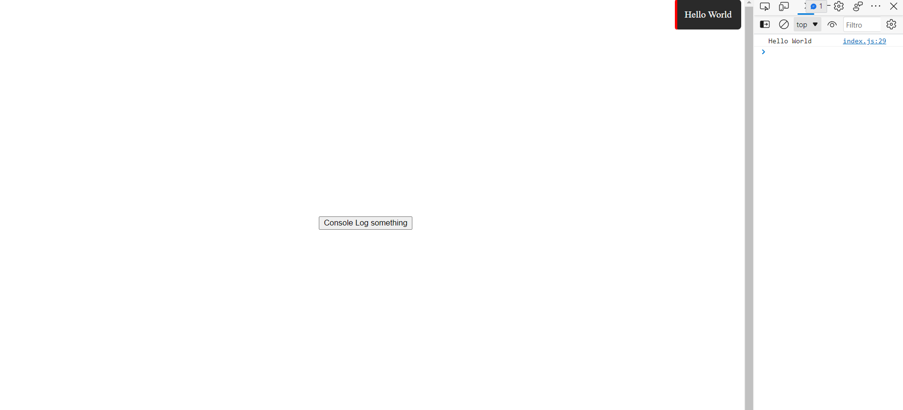

# EvoLog

This module works like a normal console.log, but it also puts on the screen the console.log in a notification style popup

I have created this little utils to view console log from tablet or phone, pretty usefeul for web dev on the go :)
## Customization
The popup can be customized with an options object like this one
```js
import Evolog from 'evolog';

const logger = new Evolog();

// this are the default value
logger.log("Hello, World", {
  backgroundColor: '#2a2a2a', // you can also use web color 
  bandColor: '#002064', // like green, red, yellow, ecc...
  textColor: '#fff',
  duration: 1000, // duration in ms
});

```

### Result

